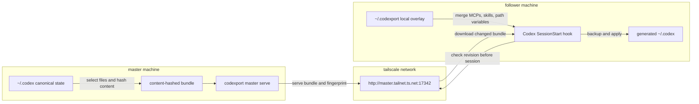
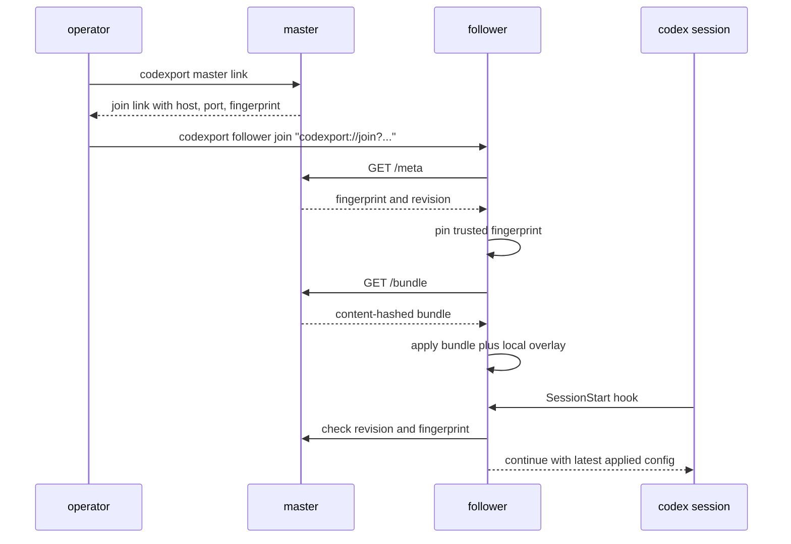

<h1 align="center">codexport</h1>

<p align="center">
  <a href="https://www.npmjs.com/package/codexport"></a>
  <a href="https://www.npmjs.com/package/codexport"></a>
  <a href="LICENSE"></a>
</p>

---

`codexport` replicates a canonical master Codex setup to follower machines. it is built for operators who want one trusted `~/.codex` source of truth, follower-local overlays, and a low-friction `npx` join path without committing plaintext secrets to GitHub.

the master serves a content-hashed bundle from its `~/.codex` directory. followers pin the master's fingerprint on join, fetch updates over a Tailscale-reachable HTTP address, and apply updates at Codex `SessionStart` through a short best-effort hook.

MCPs are exported as full definitions, including env needed by supported tools. command-based MCPs are written through a managed launcher, so followers run `npx -y codexport@latest mcp run <name>` and let `codexport` translate master-local paths into repairable package, Python tool, or source-built launchers.

[npm](https://www.npmjs.com/package/codexport) | [github](https://github.com/Microck/codexport)

## why

if you keep a carefully tuned Codex setup on one machine and want the same defaults elsewhere, `codexport` gives you a practical pull-based sync path.

- keep the master as the canonical Codex configuration source
- let followers preserve local MCPs, local skills, trust entries, and path overrides
- sync auth-bearing files through the private Tailscale path instead of a plaintext GitHub commit
- export every master MCP definition instead of dropping machine-local entries
- repair known MCP launchers on followers through npm, uvx, released binaries, or source builds
- refresh followers at Codex session startup without interrupting active sessions
- use content-hash revisions and pinned master fingerprints instead of blind file copies

## quickstart

`codexport` requires Node.js 20+.

on the master:

```bash
npx codexport master init
npx codexport master service install
npx codexport master link --host master.tailnet.ts.net
```

on a follower:

```bash
npx codexport follower join "codexport://join?host=master.tailnet.ts.net&port=17342&fingerprint=..."
npx codexport hook install
```

manual sync remains available:

```bash
npx codexport sync --apply
npx codexport status
```

## sync model



followers trust the provided Tailscale address and store the master fingerprint. later syncs refuse changed fingerprints by default, so a changed master identity requires intentional re-enrollment.

## trust flow



## included state

the master bundle includes canonical Codex config, auth files, hooks, prompts,
rules, skills, skill libraries, `AGENTS.md`, `RTK.md`, and `mise.toml` when
present.

runtime state such as logs, caches, sessions, history, compact handoffs, and
SQLite databases is excluded.

## MCP export and repair

all master MCP definitions are exported into `~/.codexport/mcp-manifest.json` on followers. generated command MCP entries in `~/.codex/config.toml` point at the managed launcher:

```toml
[mcp_servers.example]
command = "npx"
args = [ "-y", "codexport@latest", "mcp", "run", "example" ]
```

when Codex starts an MCP, `codexport mcp run` reads the original manifest entry, restores transferred environment values, rewrites master paths to follower paths, and chooses a runnable target:

| source shape | follower action |
| --- | --- |
| npm-backed MCPs | run with `npx -y <package>` |
| Python MCP tools | run with `uvx --from <package> <binary>` and install `uv` when missing |
| FFF MCP | download the matching upstream release binary when missing |
| GitQuarry MCP | build `gitquarry-mcp` from its public source when missing and repair `GITQUARRY_CLI_PATH` |
| URL MCPs | keep the URL config unchanged |

unsupported local binaries are still kept in the manifest and generated config. if a follower cannot repair one, startup fails with the missing tool and repair step instead of silently removing the MCP.

## local follower state

follower-local state lives under `~/.codexport`:

```text
~/.codexport/local.toml
~/.codexport/mcps.local.toml
~/.codexport/skills/
~/.codexport/overrides/
```

canonical MCP and skill names win by default. same-name local MCPs or skills
fail unless explicitly allowed in `local.toml`:

```toml
allowMcpOverrides = ["local-name"]
allowSkillOverrides = ["local-skill"]

[pathVariables]
workspaceRoot = "D:/workspace"
```

path variables in canonical config such as `${workspaceRoot}` are expanded from
the follower's `local.toml` before writing the generated `~/.codex/config.toml`.

## command surface

| command | purpose |
| --- | --- |
| `codexport master init` | create or refresh the master identity and bundle state |
| `codexport master serve` | serve the current canonical bundle over HTTP |
| `codexport master link` | print a durable follower join link and fallback command |
| `codexport master rebuild` | force rebuild the master bundle for repair/debugging |
| `codexport master service install` | install the user-level master background service |
| `codexport follower join` | enroll a follower from a join link or explicit master URL |
| `codexport sync` | fetch the latest master bundle |
| `codexport apply` | apply the last staged bundle |
| `codexport mcp run <name>` | run or repair a synced command MCP from the follower manifest |
| `codexport hook install` | install the follower-only Codex `SessionStart` hook |
| `codexport status` | report role, master URL, fingerprint, revision, and reachability |

## platform support

| platform | master service | follower hook | manual sync |
| --- | --- | --- | --- |
| linux with systemd user services | supported | supported | supported |
| windows 10/11 scheduled tasks | supported | supported | supported |

followers do not need a background service in v1. the hook runs a short best-effort sync at Codex session startup, and `codexport sync --apply` is available when an immediate refresh is needed.

## examples

generate a copy-paste join command:

```bash
codexport master link --host master.tailnet.ts.net
```

join with explicit trust metadata:

```bash
codexport follower join \
  --master http://master.tailnet.ts.net:17342 \
  --fingerprint <fingerprint> \
  --apply
```

check current follower state:

```bash
codexport status
```

## development

```bash
npm install
npm run typecheck
npm test
npm run build
npm pack --dry-run
```

## license

[mit license](LICENSE)
